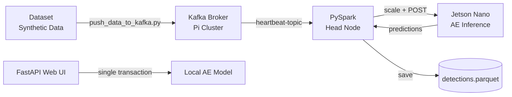
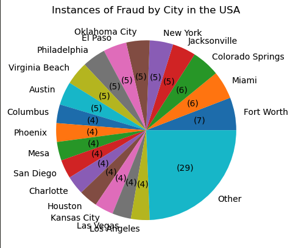
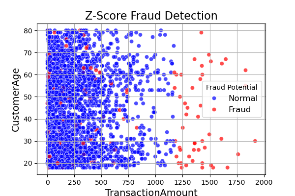
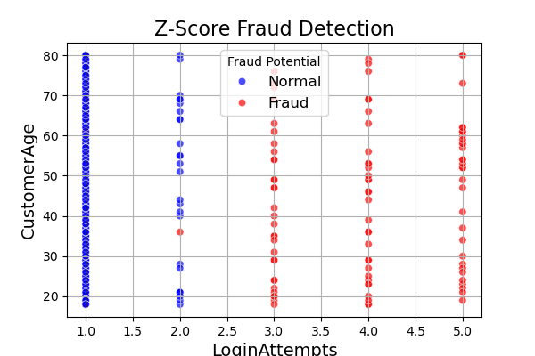
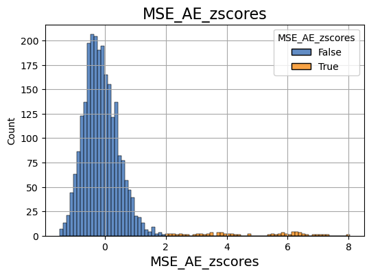
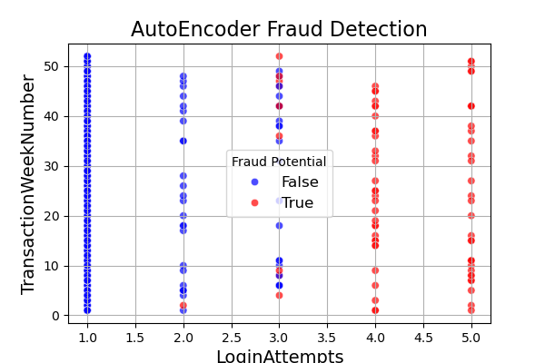
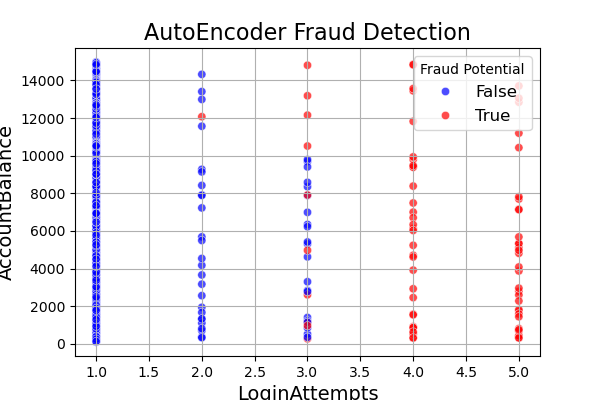

# Fraud Detection System

An end-to-end fraud detection platform that streams credit card transaction data through a distributed pipeline, evaluates each transaction using a PyTorch Autoencoder, and stores results for analysis. Built to explore unsupervised anomaly detection across the full stack — from model research to edge inference on a Raspberry Pi / Jetson Nano cluster.

---

## System Architecture



> The cluster (Kafka, Spark, Jetson inference server) is managed via a companion MCP server: [cluster_management_MCP](https://github.com/Jcardenas34/cluster_management_MCP). It provides tools to start/stop the Kafka stream, submit the Spark job, and toggle the inference server on the Jetson Nano.

---

## Models

### Autoencoder (AE)
A deep autoencoder trained exclusively on non-fraudulent transactions. At inference time, the mean squared error (MSE) of the reconstruction is converted to a z-score using the MSE distribution over the training set. Transactions with **z-score > 2.0** (~95th percentile) are flagged as fraud.

- Input: 11 numerical features (transaction type, channel, age, occupation, duration, login attempts, balance, etc.)
- Latent space: 10 dimensions
- Expected fraud rate on the Kaggle dataset: ~2%

### Variational Autoencoder (VAE) *(in progress)*
An alternative architecture that maps inputs to a probabilistic latent distribution. Trained with a combined reconstruction + KL divergence loss. Intended for comparison against the standard AE and for synthetic data generation.

> **AE vs. VAE comparison plots coming soon.**

---

## Pipeline Components

| Component | Location | Description |
|---|---|---|
| Kafka producer | `pyspark_jobs/push_data_to_kafka.py` | Streams dataset rows (real or synthetic) to Kafka topic |
| PySpark job | `pyspark_jobs/scale_datastream.py` | Consumes Kafka stream, applies StandardScaler, batches to Jetson |
| Edge inference server | `scripts/model_server.py` | Flask app on Jetson Nano; runs AE on each batch, returns z-scores |
| FastAPI web interface | `fast.py` | Local dashboard for single-transaction evaluation and dataset exploration |
| Batch inference | `scripts/live_inference.py` | Evaluates model over the full dataset and reports fraud rate |

---

## Quickstart

### 1. Download the dataset
```bash
source setup.sh
```
Fetches the [Kaggle bank transaction dataset](https://www.kaggle.com/datasets/valakhorasani/bank-transaction-dataset-for-fraud-detection) into `./dataset/`.

### 2. Install the package
```bash
pip install -e .
```

### 3. Run the FastAPI web interface
```bash
uvicorn fast:app --host 0.0.0.0 --port 8765
```

### 4. Run batch inference
```bash
python scripts/live_inference.py
```

### 5. Stream data through the cluster
Use the [cluster_management_MCP](https://github.com/Jcardenas34/cluster_management_MCP) to start Kafka, submit the Spark job, and launch the Jetson inference server. Then:
```bash
python pyspark_jobs/push_data_to_kafka.py -ip <KAFKA_BROKER_IP>
python pyspark_jobs/push_data_to_kafka.py -ip <KAFKA_BROKER_IP> -s   # synthetic data
```

### Docker (Jetson Nano — Jetpack 4.5)
```bash
sudo docker build -t fraud-detection-nano .
sudo docker run --runtime nvidia --security-opt seccomp=unconfined -p 8000:8000 fraud-detection-nano
```

---

## Results

### Z-Score Statistical Analysis
Using per-feature z-scores (threshold > 3), **140 out of 2,512 transactions** were flagged as potentially fraudulent (~5.57%). The two most discriminating features were `TransactionAmount` and `LoginAttempts`.



| Transaction Amount | Login Attempts |
|---|---|
|  |  |

### Autoencoder Anomaly Detection
Using MSE z-score threshold of 2.0, the AE targets a ~2% fraud rate on the training distribution.



| Login Attempts vs Week | Login Attempts vs Balance |
|---|---|
|  |  |

---

## Screenshots

> **TODO**: Add screenshot of the FastAPI web dashboard (`/` route — transaction table + predict form).

> **TODO**: Add screenshot of a live streaming run (Spark job output + Jetson inference logs side by side).

> **TODO**: Add AE vs. VAE reconstruction error comparison plot.

---

## Roadmap

- [ ] Clean AE vs. VAE performance comparison (precision, recall, ROC-AUC)
- [ ] LLM-driven anomaly detection layer
- [ ] Improve synthetic data generation using the trained VAE
- [ ] Persist streaming results to a database instead of flat Parquet
